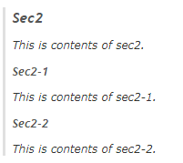
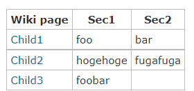

# Redmine Include Macro Extension

This plugin makes possible include wiki section.

Caution!) This plugin will overwrite the default include macro.

## Examples
```
{{include(Foo)}}
{{include(Foo, Bar)}} -- to include Bar section of Foo page
```

### Example: Include a section.
```
> {{include(Child, Sec2)}}
```


### Example: Include a section with options.
```
> {{include(Child, Sec2, noheading, nosubsection)}}
```


### Example: Include a section with options in table.
```
> |_. Title |
> | {{include(Child, Sec2, noheading, nosubsection)}} |
```


## Installation
1. Clone or copy files into the Redmine plugins directory
  ```
  git clone https://github.com/taikii/redmine_include_macro_extension.git plugins/redmine_include_macro_extension
  ```
2. Restart Redmine

## License
This plugin is released under the MIT License.
